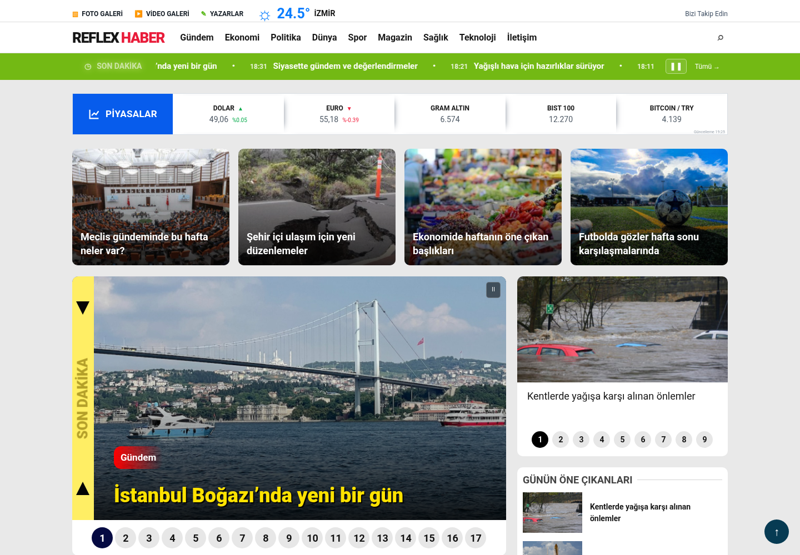
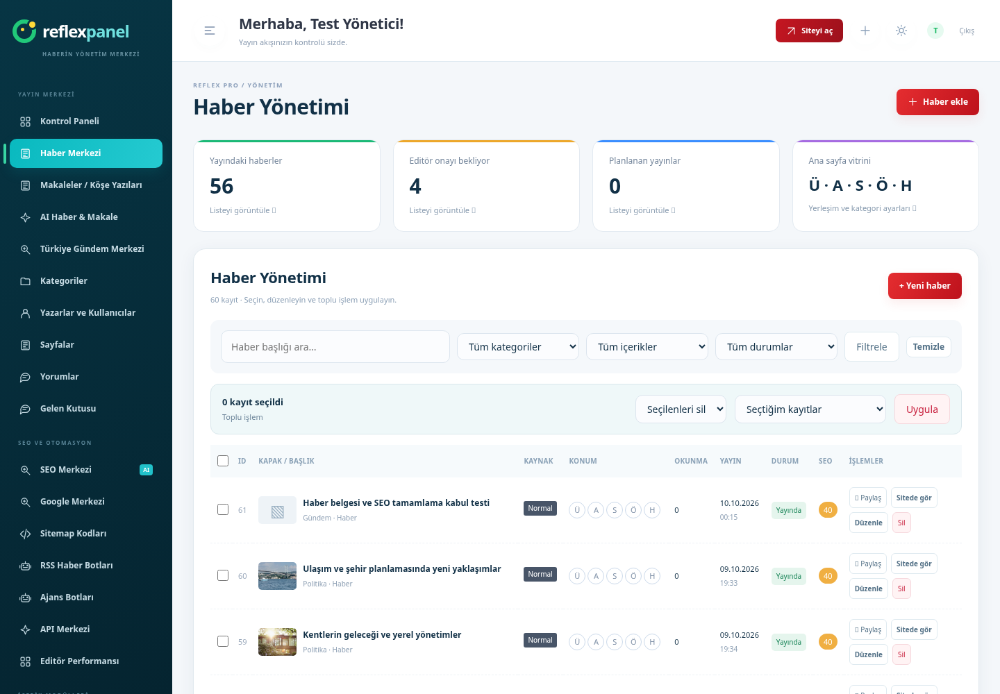

# Reflex Haber Pro · 4 Tema

Türkçe haber sitesi ve yönetim merkezi. PHP 8.1+, MySQL/MariaDB; küçük denemeler için SQLite. Composer veya Node kurulumu gerekmez.

**[Tam Pro paketi ZIP — yaklaşık 8 MB](https://github.com/pelinduyar6-pixel/pelin/raw/refs/heads/main/downloads/reflex-haber-pro-4-tema.zip)**

**[phpMyAdmin SQL paketi — ZIP](https://github.com/pelinduyar6-pixel/pelin/raw/refs/heads/main/downloads/reflex-haber-sql.zip)** · [SQL dosyası](downloads/reflex-haber-pro.sql) · [SQL içe aktarma adımları](SQL-KURULUM.md)

**[9 Ekim kurulum düzeltmesi — küçük ZIP](https://github.com/pelinduyar6-pixel/pelin/raw/refs/heads/main/downloads/reflex-haber-kurulum-duzeltmesi.zip)** · [Hata kodları ve uygulama adımları](KURULUM-DUZELTMESI.md)

**[Kurulum ve mevcut PHP sürümünü güncelleme](KURULUM.md)** · [Nginx ayarları](NGINX.md) · [SHA-256](downloads/reflex-haber-pro-4-tema.sha256)

## Dört tema, tek içerik sistemi

| Tema | Referans | Görüntü |
|---|---|---|
| 1 | Demo 6 — sarı manşet, sağ haber sütunu | [Masaüstü](previews/pro/tema-1.png) · [Mobil](previews/pro/tema-1-mobil.png) |
| 2 | Demo 8 — merkez manşet, yan kartlar | [Masaüstü](previews/pro/tema-2.png) · [Mobil](previews/pro/tema-2-mobil.png) |
| 3 | Demo 5 — kırmızı menü, geniş manşet | [Masaüstü](previews/pro/tema-3.png) · [Mobil](previews/pro/tema-3-mobil.png) |
| 4 | Demo 1 — vitrin banner ve beş kart | [Masaüstü](previews/pro/tema-4.png) · [Mobil](previews/pro/tema-4-mobil.png) |

Temalar panelden seçilir; haberler, kullanıcılar ve görseller korunur. Referansların yerleşimleri yeni PHP/CSS kodlarıyla yeniden uygulanmıştır. Haber metinleri ve görseller örnek gösterim içindir.

## Site ve panel

- Foto/video vitrinleri, kategori manşetleri, haber kartları, sağ son haberler ve sayfalama.
- Otomatik manşet geçişi, ayarlanabilir süre, duraklatma ve yumuşak sarı Son Dakika animasyonu.
- Profesyonel haber merkezi: gerçek görüntülenme/kayıt sayıları, yayın takvimi, SEO dağılımı ve canlı yenileme.
- Haber taslak/yayın/planlama, zengin editör, medya kütüphanesi, foto galeri, YouTube veya MP4/WebM yükleme.
- Haber altında emoji tepkileri, sosyal paylaşım, yazdırma, yazı boyutu, sesli okuma ve okuma ilerlemesi.
- OpenAI API anahtarıyla önizlemeli SEO önerileri; yazarken güncellenen içerik kontrol puanı.
- RSS/Atom kaynak seçimi, çalışma aralığı, taslak/yayın tercihi, tekrarları atlama ve cron.
- Ana logo, ayrı footer logosu, renk/genişlik/tema ayarları ve ana sayfa öğelerinin sırası/görünürlüğü.
- 21 reklam konumu; kod veya görsel, mobil/masaüstü seçimi, tarih ve öncelik.
- Head, body başlangıcı, body sonu, footer özel kod alanları; yalnızca yönetici erişimi.
- Canonical, NewsArticle/Breadcrumb, Open Graph, XML site haritaları, Google News haritası ve RSS.
- CSRF, parola hashleme, yetki sınırları, oturum/giriş kontrolleri, MIME/HTML temizleme ve RSS ağ/XML korumaları.

[Güncel panel](previews/pro/panel.png) · [Haber editörü](previews/pro/editor.png) · [Kategori](previews/pro/kategori.png) · [Haber](previews/pro/haber.png) · [Footer](previews/pro/footer-1.png)

## Nasıl kurulur?

Yeni klasöre ZIP'i açın → `/kurulum.php` adresini açın → veritabanı bilgilerini ve kendi yönetici e-posta/şifrenizi girin → `/panel.php` üzerinden giriş yapın.

Daha önce `reflex-haber-demo6-sifirdan.zip` PHP sürümünü kurduysanız önce yedek alın. Yeni dosyaları mevcut klasöre açarken **storage/site.php, storage/integrations.php ve uploads içeriğini koruyun**. Yeni alanlar ilk istekte otomatik eklenir. Eski Laravel paketinin üzerine açmayın.

OpenAI anahtarınızı panelde siz girersiniz; botlar için hosting cron görevi gerekir. Varsayılan yönetici şifresi, gerçek `.env`, bağlantı bilgileri ve özel API anahtarı pakette yoktur.

Yerel MySQL/SQLite kurulum ve güncelleme, yayın/medya/yetki/SEO testleri, dört temanın mobil görünümü ve otomatik geçişleri doğrulanmıştır. OpenAI yanıtları ve RSS aktarımı yerel örnek yanıtlarla test edilmiştir; canlı API hesabı ve hosting bağlantıları ayrıca denenmelidir. Canlı sunucuya dağıtım yapılmadı. SEO kuralları uygulanır; sıralama/Google News kabul garantisi verilmez.

Önceki paket [Demo 6 sıfırdan sürümü](downloads/reflex-haber-demo6-sifirdan.zip) olarak korunmuştur; yeni kurulum için yukarıdaki Pro paketini kullanın.
